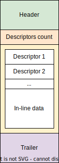

# mach_rs

## Summary

Mach ports are a powerful IPC mechanism used for most of the low-level 
communications between processes and kernel on Darwin. I/O Kit, largely
the only way to communicate with XNU drivers, and XPC, the most 
widespread userspace IPC mechanism, are both built using the Mach ports.
Exposing low-level APIs on these systems in a safe way requires 
abstractions `mach_rs` library aims to provide.

## Mach port name wrappers

Mach ports are represented by handles called "names" in userspace. Unlike
file descriptors, these refer to one or multiple "rights" on a port:

* `MACH_PORT_RIGHT_SEND`: Allows to send Mach messages to the Mach port. Multiple send right references may be held at the same time allowing for multiple senders to exist.
* `MACH_PORT_RIGHT_RECEIVE`: Allows to receive Mach messages from the port and to create send and send-once rights. Only one receive right reference may be held which limits the number of receivers to one.
* `MACH_PORT_RIGHT_SEND_ONCE`: Allows to send a single Mach message to the port. After the message is sent, the right is destroyed. Multiple send rights may exist at the same time, however each right may only have one reference.
* `MACH_PORT_RIGHT_PORT_SET`: Allows to receive messages from multiple ports in one call. Currently `mach_rs` does not support port sets.
* `MACH_PORT_RIGHT_DEAD_NAME`: Rights may be converted to dead names under certain conditions (e.g. when a receive right is destroyed, send rights become dead name rights). These may also be created manually.

While send and receive rights, for example, are referenced by the same name inside the same process (IPC space) the reference counts for the rights are managed separately. `mach_rs` makes this distinction on the type level by providing 3 wrappers for Mach port names:

* `SendRight` wraps a name that holds a reference on a send right. These may be cloned by incrementing the send right's reference count and decrement the latter when dropped.
* `RecvRight` wraps a name that holds a reference on a receive right. These may not be cloned and destroy the receive right when dropped by decrementing its only reference.
* `SendOnceRight` wraps a name that holds a reference on a send once right. These may not be cloned and destroy the send once right when dropped by decrementing its only reference.

## Sending/Receiving Mach messages

Mach message format is quite non-trivial. All Mach messages start with a fixed-size header followed by optional descriptors, inline data and a trailer that is only present in received messages.

`mach_rs` provides data structures that can be used to build and parse such messages. See docs for the `msg` module for more info.